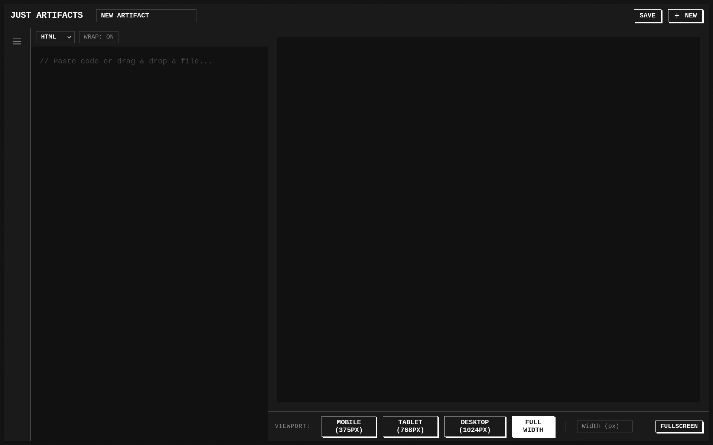

# Just Artifacts

A single-page web application for previewing AI-generated code artifacts. This is a personal tool—no backend, no authentication, no sharing. Everything persists in `localStorage`.

## Features

- **Code Preview**: Live preview of HTML/CSS/JS or React code.
- **Language Support**: Toggle between standard HTML and React (with Babel/React 18).
- **Drag & Drop**: Drop `.html`, `.jsx`, `.css`, and other text files directly onto the editor.
- **Device Presets**: Test responsiveness with Mobile, Tablet, Desktop, and Custom width presets.
- **Fullscreen Mode**: View artifacts in a distraction-free fullscreen overlay.
- **Local Persistence**: Save, load, and delete artifacts using browser `localStorage`.
- **Keyboard Shortcuts**: `Ctrl+S` save, `Ctrl+N` new artifact, `Ctrl+B` toggle sidebar.

## Design System — Terminal Brutalist

The interface follows a strict design language:

- **Monospace everywhere.** All UI chrome—headers, buttons, labels, inputs—uses a monospace font stack. Sans-serif is reserved for body prose only.
- **No border-radius.** Every element is a sharp rectangle. Hard edges read as infrastructure.
- **Offset shadows, not blurred.** Buttons use flat offset shadows (`2px 2px 0`) and invert colors on hover. No gradients, no blur.
- **Uppercase labels.** All UI chrome text is uppercase. Visual discipline for a tool aesthetic.
- **Semantic color only.** The palette is near-monochrome (`#1a1a1a` background, `#ffffff` foreground). Color enters only through semantic states: green for additions, red for danger.
- **1px borders.** Every line is 1px solid. No thicker lines, no light/dark gradient tricks.

## Usage

**Live site**: [just-artifacts.vercel.app](https://just-artifacts.vercel.app/)

Simply open `index.html` in your web browser. No build step or server required.

1. **Write or Paste Code**: Type in the left code panel, or drag & drop a file.
2. **Select Language**: Choose "HTML" or "React" from the header bar above the editor.
3. **Preview**: See the live result in the right panel.
4. **Save**: Click "Save" to store the artifact locally. You must rename it from "New_Artifact".
5. **Manage**: Open the sidebar (`Ctrl+B`) to view, load, and delete saved artifacts.

## Tech Stack

- **HTML5**
- **Vanilla JavaScript**
- **Terminal Brutalist CSS** (custom design system, no frameworks)
- **React/ReactDOM/Babel** (CDN for React preview mode only)
